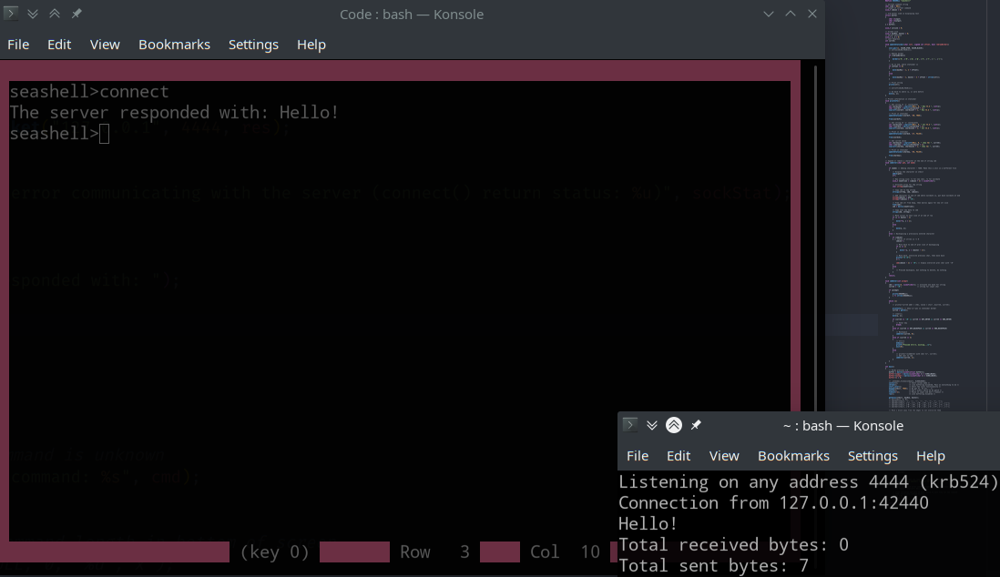

SeaShell
========

A cross-platform shell with extra capabilities, without needing a custom agent like meterpreter. Still a work in progress.

Compiles in Linux, Windows sockets still in the works.

Not to be used in production (yet).

Reverse Shell
-------------

Type `connect` to connect to an IP.

Bind Shell
----------

Not yet implemented.

To-Do
-----

### Important features

* [ ] Get bind shell and reverse shell functionality working bug-free
* [ ] Set up buffer for scrollback and configure it on a variable value, using the heap for memory
* [ ] Get SeaShell PoC to actually work for remotely controlling shells
* [ ] Get cursor movement and deletion in both directions working
* [ ] Add screen resizing support

### Extra features

* [ ] Add ability to spawn shell sessions which can be entered into, like meterpreter
* [ ] Ability to automatically perform OS/interface checks and present info to user in status bar
* [ ] Ability to automatically set up persistentence automatically based on OS
* [ ] Ability to automatically determine possible privilege escalation methods
  * [ ] Custom SeaShell command to attempt PrivEsc of a certain type or all possible types of PrivEsc
* [ ] Internal tmux imitation
* [ ] Customimization file, supporting:
  * [ ] Custom shortcuts for tmux-ing
  * [ ] Different colors
  * [ ] Whether to automatically perform OS info checks, set up persistentence automatically, and privesc
